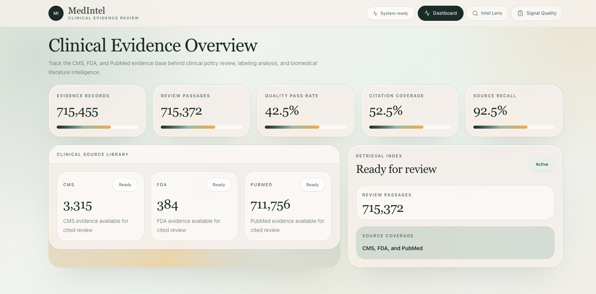
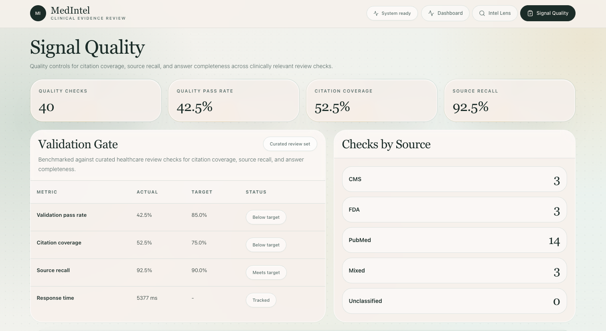
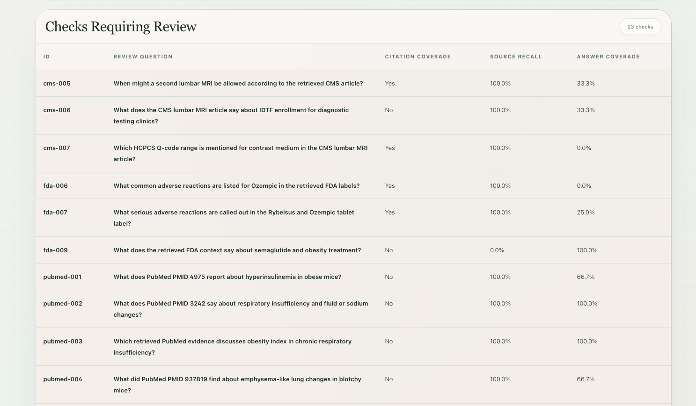

# MedIntel

MedIntel is a clinical evidence review platform for healthcare teams working across CMS coverage policy, FDA drug labeling, and PubMed literature. It helps policy, safety, medical affairs, and analytics teams ask focused questions, inspect cited source material, and understand why particular evidence was selected.

Under the hood, MedIntel turns large healthcare corpora into citation-backed briefs with transparent source rationale, Spark-based processing, Dagster orchestration, Qdrant retrieval, and OpenAI-assisted reasoning. The system is built around a stable lake contract: source archives are normalized into canonical records, processed through Spark stages, chunked into citation-ready retrieval units, indexed with deterministic IDs, evaluated with quality gates, and served through a professional Next.js interface. The same contract supports workstation execution, shared infrastructure, and TB/PB-scale healthcare corpora without changing the application layer.

## Product Experience

MedIntel is designed for review workflows where trust matters: coverage teams need source context, safety teams need label language, and research teams need clear citations back to the underlying literature.

The dashboard gives teams a quick operational view of the evidence base, review passages, citation quality, source recall, and available CMS, FDA, and PubMed coverage.



Signal Quality tracks the evaluation gate behind the experience. It shows whether answers are meeting citation, source recall, and completeness targets, then surfaces the checks that need follow-up.



The quality review table makes failed checks inspectable instead of hiding them behind a single score. This is useful when improving retrieval behavior, source coverage, or evaluation questions.



The MedIntel Lens flow keeps the review interaction focused: ask a source-grounded question, watch the brief assemble, then inspect cited documents and ranking signals.

## Demo

[](docs/assets/readme/medintel-lens-review-flow.mp4)

_Click the preview to watch the demo._

## What MedIntel Does

- Ingests real CMS Medicare Coverage Database archives, openFDA drug labels, and PubMed baseline XML.
- Converts heterogeneous source formats into canonical healthcare JSONL records with stable identifiers and lineage metadata.
- Processes the lake through Spark stages for manifesting, bronze ingest, source normalization, entity extraction, quality signals, policy comparison, and retrieval corpus selection.
- Orchestrates the workflow in Dagster so pipeline runs, step logs, retries, and evaluation gates are observable.
- Chunks source records into citation-preserving retrieval units that retain source, document, section, version, and authority metadata.
- Indexes retrieval chunks in Qdrant with idempotent upserts and deterministic point IDs.
- Serves source-filtered clinical review through MedIntel Lens, including citations, ranking signals, rerank rationale, and streamed brief generation.
- Evaluates review quality with a 40-question representative suite, citation coverage checks, source recall thresholds, and improvement diagnostics.

## Architecture

```mermaid
flowchart LR
  sources["CMS MCD archives<br/>openFDA labels<br/>PubMed baseline XML"] --> landing["Lake landing zone<br/>source archives + canonical JSONL"]
  landing --> dagster["Dagster control plane<br/>jobs, logs, schedules, gates"]
  dagster --> spark["Spark processing<br/>manifest -> bronze -> normalized -> entities -> quality -> retrieval corpus"]
  spark --> chunks["Citation chunks<br/>stable IDs, section metadata, source authority"]
  chunks --> embed["Embedding layer<br/>batch vectors, deterministic metadata, pluggable model provider"]
  chunks --> lexical["Lexical/entity signals<br/>terms, codes, drugs, conditions, publication authority"]
  embed --> qdrant["Qdrant collections<br/>vector candidates + payload filters"]
  lexical --> ranker["Hybrid ranking<br/>source filters, lexical score, entity score, authority score"]
  qdrant --> ranker
  ranker --> rerank["Reranking layer<br/>cross-encoder style scoring when configured"]
  rerank --> answer["Answer assembly<br/>grounded brief + citations + ranking trace"]
  answer --> api["Express API<br/>streaming responses + quality endpoints"]
  api --> ui["Next.js MedIntel UI"]
  dagster --> evals["Evaluation gates<br/>quality thresholds + failure analysis"]
  evals --> ui
```



## Processing Model

MedIntel treats every source family as a contract, not as one-off parsing code.

CMS records carry policy identifiers, article/LCD/NCD family, revision/version, CPT/HCPCS terms when available, jurisdiction, and section text. FDA records preserve product identifiers, labeling sections, safety language, ingredients, indications, warnings, and update metadata. PubMed records preserve PMID, title, abstract text, journal metadata, publication dates, and biomedical terms.

Spark jobs write each stage with stable run IDs and deterministic document IDs. Re-running the same source profile updates existing records instead of creating duplicate retrieval points. That matters operationally: large healthcare corpora are always moving, and the platform needs repeatable batch behavior before it can scale safely.

## Chunking Strategy

Chunking is source-aware because healthcare evidence is not uniform text.

CMS chunks are biased toward policy sections, article bodies, coverage language, procedure-code context, and revision-aware citations. FDA chunks are section-oriented around labeling concepts such as indications, warnings, adverse reactions, dosage, and contraindications. PubMed chunks preserve title and abstract context together so the retrieval layer can cite the PMID-level record cleanly.

Each chunk carries:

- `chunk_id`: deterministic ID derived from source, document ID, version, and text position.
- `document_id`: stable canonical document identifier.
- `source_type`: `cms`, `fda`, or `pubmed`.
- `citation`: human-readable source reference for the UI.
- `text`: retrieval text selected for semantic and lexical matching.
- `metadata`: section, entities, matched terms, authority signals, and lineage fields.

At PB scale, this design lets Spark partition by source type, publication/update date, document family, and run ID. Chunk IDs remain stable across object stores and compute clusters, which keeps Qdrant upserts idempotent and makes backfills manageable.

## Embeddings and Indexing

The embedding layer is intentionally pluggable. The current workstation profile can use deterministic local vectors for repeatable development and evaluation, while the same indexing contract can be pointed at a biomedical embedding model for higher recall in larger deployments.

The indexing job batches chunks, attaches payload metadata, and writes to Qdrant with deterministic point IDs. Payload filters allow the API to restrict queries by source family before ranking. Because the point ID is derived from source identity instead of ingestion order, repeated runs update the collection cleanly.

For large corpora, embedding becomes a distributed Spark workload: partition chunks, batch model calls or GPU inference, write vector manifests, and upsert by partition into sharded Qdrant collections. The application continues to query the same API surface while the compute plane scales independently.

## Ranking and Reranking

MedIntel uses a layered retrieval strategy:

- Candidate generation from Qdrant vectors and source-filtered payloads.
- Lexical matching for exact codes, PMIDs, drug names, conditions, and policy terms.
- Entity scoring for extracted healthcare entities.
- Authority scoring for source reliability and citation quality.
- Reranking with a cross-encoder style layer when OpenAI reranking is configured.
- Final answer synthesis with citations and a visible ranking trace.

The UI shows final rank, pre-rerank signals, matched terms, matched entities, authority score, and rerank rationale. This is deliberate: stakeholders should be able to see why a source was selected instead of treating the answer as a black box.

## Petabyte-Scale Operating Model

The platform is designed so data scale changes infrastructure, not semantics.

- Lake storage can live on local disk, S3-compatible object storage, Cloudflare R2, ADLS, or GCS.
- Spark workers scale parsing, normalization, chunking, entity extraction, and embedding batches.
- Dagster remains the control plane for observability, retries, schedules, and quality gates.
- Qdrant collections can be sharded by source, time window, document family, or tenant boundary.
- Stable IDs make full refreshes, partial backfills, and incremental updates operationally safe.
- Evaluation gates prevent retrieval regressions from silently shipping after corpus expansion.

The key architectural choice is that ingestion, chunking, embedding, indexing, answer generation, and evaluation communicate through explicit data contracts. That is what allows a workstation run and a fleet-backed run to use the same source semantics.

## Technology Stack

| Layer | Technologies |
| --- | --- |
| Frontend | Next.js 16, React, Tailwind CSS, lucide-react |
| Backend | Node.js, Express, TypeScript, streaming responses |
| Orchestration | Dagster webserver, Dagster daemon, run history, step logs |
| Processing | Python 3.11+, PySpark 3.5, pandas, pyarrow |
| Retrieval | Qdrant, deterministic upserts, hybrid lexical/vector ranking |
| Intelligence | OpenAI answer generation and reranking when configured |
| Storage | Canonical lake layout with local and object-store-compatible paths |
| Infrastructure | Docker Compose for Postgres and Qdrant |

## Repository Layout

| Path | Purpose |
| --- | --- |
| `frontend/` | Next.js MedIntel interface |
| `backend/` | Express API, streaming answer endpoint, dashboard/eval APIs |
| `pipeline/jobs/` | Source ingestion, Spark processing, indexing, and evaluation jobs |
| `pipeline/dagster_defs.py` | Dagster job definitions for pipeline orchestration |
| `pipeline/evals/` | Representative evaluation questions |
| `infra/` | Database and deployment-oriented infrastructure files |
| `docs/` | Runbooks, architecture notes, and generated project media |

## Prerequisites

- Python 3.11+
- Java 17 or another Spark-compatible JDK
- Docker Desktop or compatible Docker engine
- Node.js and npm
- PostgreSQL client tools for `psql`
- Optional: OpenAI API key for answer generation and reranking
- Optional: NCBI and FDA API keys for higher public API rate limits

## Environment Setup

Create and activate the Python environment:

```bash
python3 -m venv .venv
source .venv/bin/activate
pip install -r pipeline/requirements.txt
```

Install Java if Spark is not already available on your machine, then confirm:

```bash
java -version
```

Install frontend and backend dependencies:

```bash
cd backend && npm install
cd ../frontend && npm install
cd ..
```

Create the environment file:

```bash
cp .env.example .env
```

For OpenAI-backed answers and reranking, set:

```bash
OPENAI_API_KEY=...
LLM_PROVIDER=openai
OPENAI_MODEL=gpt-4.1-mini
```

## Start Infrastructure

```bash
make local-up
make db-init
```

This starts the local service dependencies used by the API and retrieval stack.

## Acquire Real Data

Small source profile:

```bash
make fetch-small-data
```

Representative CMS, FDA, and PubMed profile:

```bash
make local-representative-raw
```

CMS Medicare Coverage Database archives include CPT/CDT/UB-04 license terms. Run CMS archive download and parse steps only when you are authorized to use the data:

```bash
CMS_MCD_LICENSE_ACCEPTED=true make download-cms-mcd-current
CMS_MCD_LICENSE_ACCEPTED=true make parse-cms-mcd-current
```

FDA and PubMed representative acquisition can also be run independently:

```bash
make fetch-fda-representative
make download-pubmed-representative
make extract-pubmed-representative
```

## Run the Spark Pipeline

Small end-to-end path:

```bash
make local-e2e-small
```

Representative processing path:

```bash
make local-representative-pipeline
make local-representative-rag-index
```

Direct Spark stage sequence:

```bash
make local-pipeline RUN_ID=local-representative
make local-rag-index RUN_ID=local-representative
```

## Run with Dagster

Start Dagster:

```bash
make dagster-webserver
make dagster-daemon
```

Open Dagster at:

```text
http://127.0.0.1:3002
```

List available jobs:

```bash
make dagster-list
```

Primary Dagster jobs:

| Job | Purpose |
| --- | --- |
| `local_real_small_rag_job` | Small real-data processing and indexing path |
| `local_representative_rag_job` | Representative CMS/FDA/PubMed processing and indexing path |
| `local_representative_rag_eval_job` | Representative evaluation run |
| `local_representative_rag_eval_gate_job` | Evaluation run with required thresholds |

The internal job names include `rag` because they are stable pipeline identifiers. The product surface uses MedIntel Lens and source-intelligence language.

## Run the Application

Start the backend:

```bash
make backend
```

Start the frontend:

```bash
make frontend
```

Open:

```text
http://127.0.0.1:3000
```

API health and data endpoints are served from:

```text
http://127.0.0.1:4000
```

## Evaluation

Run the representative evaluation:

```bash
make local-representative-rag-eval
```

Run the quality gate:

```bash
make local-representative-rag-eval-gate
```

The evaluation suite checks answer quality, citation hit behavior, and source recall. Results feed the Signal Quality page so failures can be inspected by source family and question type.

## Operational Notes

- Re-running indexing jobs updates existing Qdrant points through deterministic IDs.
- Dagster run history is orchestration metadata; it does not duplicate source records.
- Source filters in MedIntel Lens are passed to the backend and applied during retrieval.
- The answer stream is delivered incrementally so the UI can show the brief as it is generated.
- Retrieval scores are surfaced to make ranking behavior inspectable by engineers and stakeholders.

## Roadmap

- Swap the workstation embedding profile for a biomedical embedding model on larger corpora.
- Expand FDA coverage by drug class, safety topic, product update stream, and label revision.
- Add richer evaluation slices by source family, question type, and expected citation behavior.
- Add partition-aware embedding manifests for multi-worker indexing.
- Add deployment profiles for shared control-plane infrastructure and external object storage.

## Safety

MedIntel is for healthcare policy, labeling, and biomedical evidence research support. It does not provide diagnosis, treatment instructions, patient-specific recommendations, or a substitute for clinician judgment.
