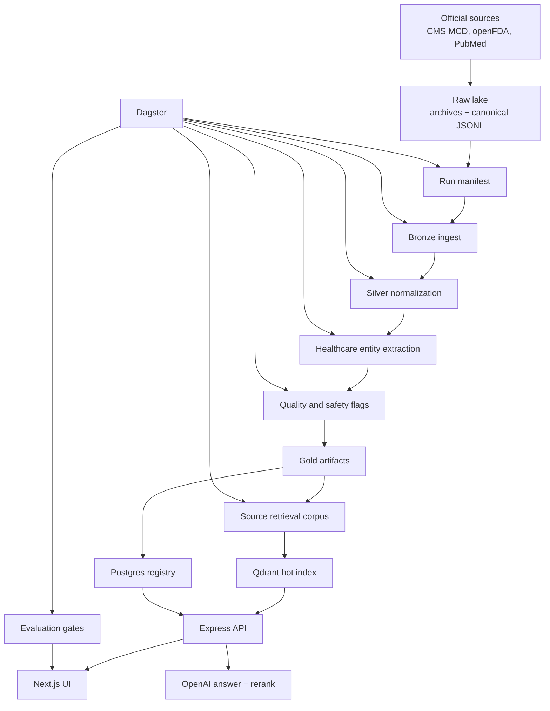

# Architecture

MedIntel is organized around one principle: the lake is the source of truth, and every derived system can be rebuilt from it.

## System View



## Data Contract

Every run writes to the same lake layout:

```text
data/lake/
  raw/
  bronze/
  silver/
  gold/
  retrieval/
  reports/
  manifests/
  evals/
```

The local representative profile and any future full-corpus profile use the same document schema and derived artifact paths. That lets the project validate the product locally, then scale storage or compute later without changing the application contract.

## Retrieval Path

1. Source filters from the UI are passed to the backend.
2. Qdrant retrieves candidate chunks from the selected sources.
3. Streaming lexical search adds exact term/entity recall.
4. Candidates are merged and deduplicated by `chunk_id`.
5. OpenAI reranking scores candidate relevance when configured.
6. The answer generator receives only the selected, citation-ready context.
7. The UI shows citations, source ranking, matched terms, matched entities, vector score, rerank score, and scoring formula.

Qdrant is a hot retrieval index, not long-term storage. Point IDs are deterministic, so reruns update vectors instead of creating duplicate index entries.

## Orchestration

Dagster is the preferred way to run local data workflows. It provides visible logs, step status, rerun history, and a clean boundary between data processing and application serving.

Primary jobs:

- `local_real_small_rag_job`
- `local_representative_rag_job`
- `local_representative_rag_eval_job`
- `local_representative_rag_eval_gate_job`

The internal job names retain `rag` for compatibility with existing pipeline code. Product-facing UI and documentation use MedIntel Lens and source-analysis terminology.

## Optional Scale-Out

Cloudflare R2, RunPod, and Hetzner are optional infrastructure targets:

- R2 can store the same lake keys used locally.
- RunPod can run larger Spark and embedding workloads.
- Hetzner can host the long-running application and control plane.

These are deployment choices, not prerequisites for the core product workflow.
